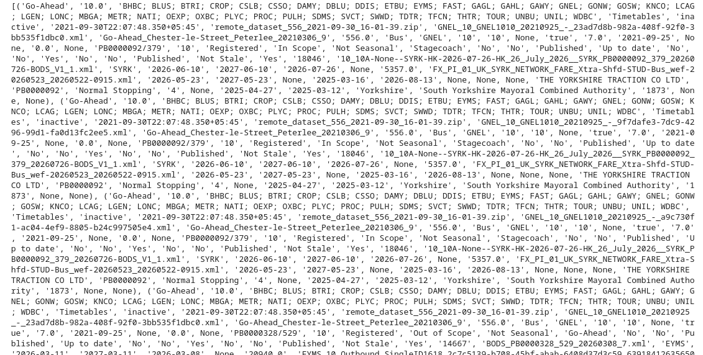

#### Data Storage, Processing, and Management

### 1. Overview
This document details the architectural approaches taken for data persistence strategies, relational database design,
and security implementations utilized within the data pipeline. (Note: This relates to No. 2 Core requirement)

### 1. Dataset Integration & Distributed Joins

## Core Requirement Fulfilled

* **Integration of multiple datasets using joins (PySpark or SQL):** Establishing complex structural relationships across distinct transit catalogues.

## Code Implementation

```python
# Surgical Join: Joining on Service Code (Catalogue) and Registration:Service Number (Compliance)
df_unified = df_cat.join(
    df_comp,
    df_cat["Service Code"] == df_comp["Registration:Service Number"],
    how="right"
)
print(f"Row count after surgical join: {df_unified.count()}
```

## Justification
To mitigate the risk  of severe operational risks, as we have to deal with performing multi-dataset joins across massive public transports datasets on a single-node engine (standard Pandas), PySpark manages this complex operation across distributed cluster memory nodes by compiling an optimized execution plan, safely establishing the relationship between catalogues while maintaining scale-free performance. This process yielded a verified baseline record count of 103,437 rows.

### 2. Data Persistence & Intermediate Checkpointing

## Core Requirement Fulfilled

* **Data persistence strategies:** Implementation and explanation of intermediate writes/checkpointing to break execution lineage.

## Code Implementation

```python
# 1. Intermediate Write
intermediate_path = os.path.join(DATA_DIR, "cleaned_checkpoint_csv")
df_cleaned.write.mode("overwrite").option("header", "true").csv(intermediate_path)

# 2. Loading Relational Database from Checkpoint
df_checkpoint = spark.read.option("header", "true").csv(intermediate_path)
```

## Justification
PySpark operates on lazy evaluation paradigm, meaning it delays executing transformations until a solitary terminal action (ex: count()) is explicitly defined. This leads to Spark having to re-compute every single transformation all the way back from the raw baseline CSV files.

Writing the hardened df_cleaned DataFrame to physical disk storage breaks Spark's DAG lineage chain. It saves the computed state permanently to disk so that downstream operational structures can read it instantly, protecting system resources against costly upstream recalculations.

### 3. Relational Database Design & Hybrid Framework Justification

## Core Requirement Fulfilled

* **Database design and implementation for storing processed data:** Storing datasets efficiently using relational databases (SQLite).
* **Tool Guidance:** Selective usage of Pandas at architectural boundaries for low-overhead processing.

## Code Implementation

```python
# Conversion to Pandas for native SQLite loading
pandas_df = df_checkpoint.toPandas()
conn = sqlite3.connect(db_path)
pandas_df.to_sql("operator_compliance", conn, if_exists="replace", index=False)
```

## Justification

Python's native, secure sqlite3 engine requires a localized, single-node memory object to process open connections and stream row segments into a local .db file.

Utilizing the localized .toPandas() operation strictly at this specific architectural boundary downsamples the processed data into a native high-performance dataframe variable, providing seamless compatibility with the local database engine without introducing heavy, unoptimized external network drivers. The table operator_compliance inside bods_analytics.db successfully holds all 103,437 clean records.


### 4. Secure Database Connectivity & Parameterized Queries

## Core Requirement Fulfilled

* **Apply secure database connectivity:** Enforcing strict parameterized queries (no string concatenation) to completely prevent SQL Injection (SQLi) attacks.

## Code Implementation

```python
def secure_search_operator(operator_name):
    query = 'SELECT * FROM operator_compliance WHERE "Operator" = ? LIMIT 5'
    cursor = conn.cursor()
    cursor.execute(query, (operator_name,))
    results = cursor.fetchall()  # Fetches the rows
    cursor.close()
    return results               # Passes the rows back to the variable

# Run the test query
test_results = secure_search_operator("Go-Ahead")
print(test_results)

# Safely close the connection after printing
conn.close()
```
## Justification

Standard string parsing or dynamic token mechanisms (such as Python f-strings or text additions like f"WHERE Operator = '{operator_name}'") pass raw user inputs directly into the relational compiler as executable logic blocks, leaving the system highly vulnerable to destructive script injection attacks.

The ? placeholder syntax instructs the SQLite database engine to isolate the query's logical instructions from incoming variable components entirely. The operator_name parameter is compiled strictly as a literal text value wrapper, rendering any embedded malicious SQL sub-commands completely inert. Testing this interface with "Go-Ahead" returns valid, safe structural output rows.



Furthermore, the display of the rows above clarify the working of the parameterized queries.