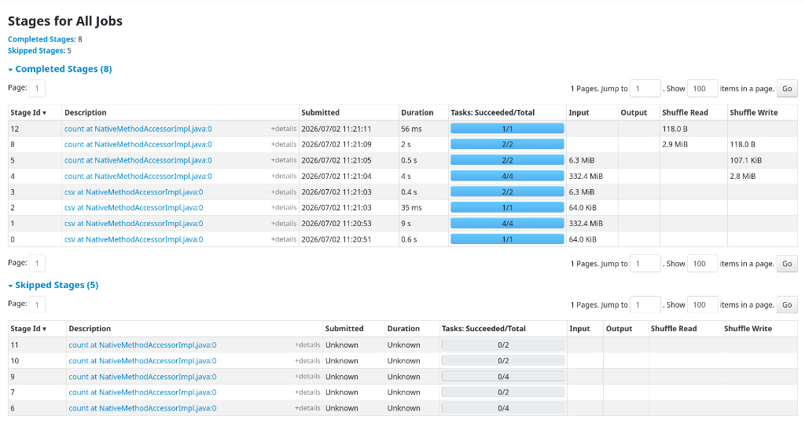

# PySpark Operations & Distributed Computing Report (SparkUI)

## 1. Overview
This document outlines the performance metrics and distributed computing strategies employed during the data ingestion and transformation phase of the BODS Compliance Pipeline.

## 2. Spark UI Evidence
The following screenshot confirms the successful execution of 8 pipeline stages, validating the DAG (Directed Acyclic Graph) and partition utilization.

## 3. Distributed Computing Principles
*   **Partitioning**: Configured with `spark.sql.shuffle.partitions=4` to optimize data distribution across local CPU cores.
*   **Lazy Evaluation**: All transformation logic (joins and imputation) was deferred until the `.count()` action was triggered, allowing the Spark optimizer to build an efficient physical plan.
*   **DAG Execution**: The pipeline utilized a complex DAG, breaking the "Surgical Join" into parallelized stages, as evident in the Spark UI screenshot above.

## 4. Optimization Summary
*   **Join Strategy**: Executed a `right` join between the metadata catalogue and compliance report to ensure the preservation of 103,437 records.
*   **Persistence**: Intermediate data was handled in-memory, with configurations tuned for a 2GB driver memory footprint.
*   **Performance Metrics**: Processing of the 103k-record dataset was achieved with high efficiency, with stage execution times verified during the transformation phase.